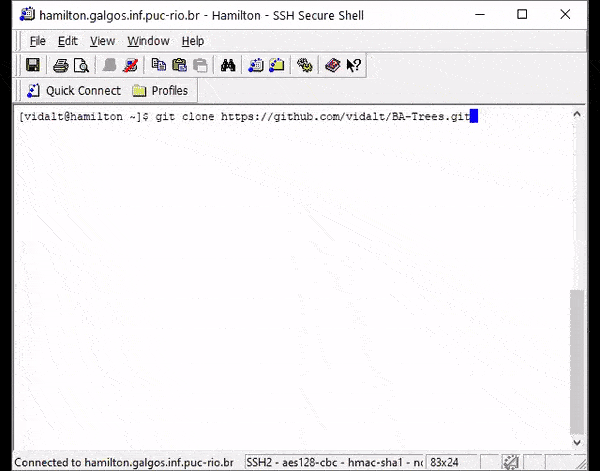
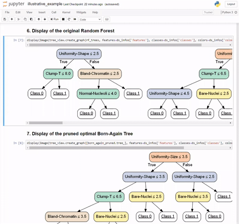

# Born-Again Tree Ensembles

This repository contains the source code and data associated to the paper "Born Again Tree Ensembles", by Thibaut Vidal and Maximilian Schiffer, with the help of Toni Pacheco who contributed during the paper submission and revision period. This paper has been presented at the 37th International Conference on Machine Learning (ICML 2020).

## Test Environment

This code has been tested on Ubuntu 18.04 using GCC compiler v9.2.0 for the C++ algorithm, as well as on Windows 10 using MinGW or Visual Studio 2017 for compilation. 
We used Anaconda distribution with Python 3.7 for all other codes and scripts.
We recommend using a similar configuration to avoid any possible compilation issue.

## Folder Structure

The repository contains the following folders:

docs<br>
src<br>      |-------born_again_dp<br>     |-------resources<br>

### docs:

* The docs folder contains the pdf files of paper (born-again.pdf) and its supplementary material (born-again-supplementary.pdf).
* This folder also contains a jupyter notebook (illustrative_example.ipynb) containing a working example of the code pipeline, including some visualization and evaluation scripts.
* The file requirements.txt contains the list of packages that must be installed to run the notebook. If a package is missing, you can easily add it via pip or anaconda using either <em>pip install "package"</em> or <em>conda install "package"</em>.
* Important: Graphviz installation sometimes fails to correctly update the "PATH" variable in the system. To circumvent this issue, we recommend to install this package via anaconda using <em>conda install python-graphviz</em> 

#### src\born_again_dp:

* This folder contains the C++ implementation of the optimal and heuristic BA-Tree algorithms.
* This folder also contains a bash script (runAllDatasets.sh) which can be executed to run the algorithm on all datasets, folds, for all objective functions, and considering a different number of trees as input. The results of this script are stored in the folder src\output. Due to the number of datasets and tests, this experiment requires some CPU time (approximately 24h).

#### src\resources

* This folder contains two subfolders, one (datasets) contains the original data sets as well as the training data and test data subsets created by ten-fold cross validiation. 
* The other (forests) contains the random forests which have been generated with scikit-learn v0.22.1 from these data sets. These forests are used as input to the BA-trees algorithms.

## Installation and Usage

The code, located in `src\born_again_dp`, can be built by simply calling the <em>make</em> command.
This requires the availability of the g++ compiler.<br> 



By default, the simple makefile provided in this project does not link with CPLEX to facilitate installation and portability.
As a consequence, the call to the MIP solver to prove faithfulness of a region in the heuristic BA-tree is deactivated (USING_CPLEX = false).
To compile with CPLEX and guarantee faithfulness in the heuristic, make sure that CPLEX is installed in your system, adapt the makefile with the correct library path, and run the command "make withCPLEX=1".

### Using the C++ algorithm

After compilation, the executable can be directly run on any input file representing a tree ensemble with the following command line:

```
Usage:
   ./bornAgain input_ensemble_path output_BAtree_path [list of options]
Available options:
  -obj X	       Objective used in the algorithm: 0 = Depth ; 1 = NbLeaves ; 2 = Depth then NbLeaves ; 4 = Heuristic BA-Tree (defaults to 4)
  -trees X      Limits the number of trees read by the algorithm from the input file (X in 3 to 10, defaults to 10)
  -seed X       Defines the random seed (defaults to 1)
```
Examples: <br>
`./bornAgain ../resources/forests/FICO/FICO.RF1.txt my_output_file`<br>
`./bornAgain ../resources/forests/COMPAS-ProPublica/COMPAS-ProPublica.RF7.txt my_output_file -trees 4 -obj 2`

### Running the Jupyter Example

The "docs" folder contains a jupyter notebook called illustrative_example.ipynb. This notebook contains a working example of the code pipeline, including some visualization and evaluation scripts.



## Contributing

If you wish to contribute to this project, e.g;, to the code, portability or integration, we encourage you to contact us by email:<br> ``vidalt AT inf.puc-rio.br``

## Team

Contributors to this code:
* <a href="https://github.com/vidalt" target="_blank">`Thibaut Vidal`</a>
* <a href="https://github.com/toni-tsp" target="_blank">`Toni Pacheco`</a>
* <a href="https://github.com/mxschffr" target="_blank">`Maximilian Schiffer`</a>

## License

[](http://badges.mit-license.org)

- **[MIT license](http://opensource.org/licenses/mit-license.php)**
- Copyright 2020 © Thibaut Vidal, Toni Pacheco and Maximilian Schiffer
